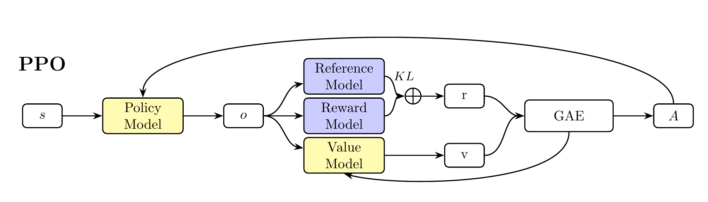
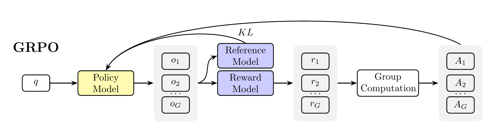
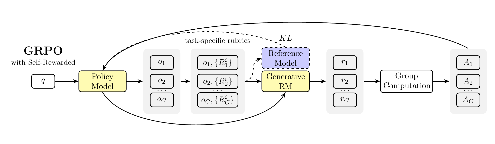

# TikZ Figures

LaTeX/TikZ figures for reinforcement learning algorithms. All figures are compiled to both PDF and PNG formats.

## Figures

| Figure | Description | Source |
|--------|-------------|--------|
| PPO | Proximal Policy Optimization algorithm flowchart | [PPO.tex](PPO.tex) |
| GRPO | Group Preference Optimization algorithm flowchart | [GRPO.tex](GRPO.tex) |
| GRPO with Self-Rewarded | Self-rewarded GRPO algorithm flowchart | [GRPO_self_reward.tex](GRPO_self_reward.tex) |

### PPO

Proximal Policy Optimization algorithm flowchart showing the complete training pipeline with policy model, reference model, reward model and value model.



### GRPO

Group Preference Optimization algorithm flowchart



### GRPO with Self-Rewarded

Self-rewarded GRPO algorithm flowchart with task-specific rubrics, refernce model can be safely ignored here. 



## Build

To compile all figures and generate PNG files:

```bash
./compile_all.sh
```

This script will:

- Compile all `.tex` files to PDF using `pdflatex`
- Convert PDFs to high-resolution PNG files (300 DPI)
- Save PNG files in the `fig/` directory
- Clean up auxiliary files
